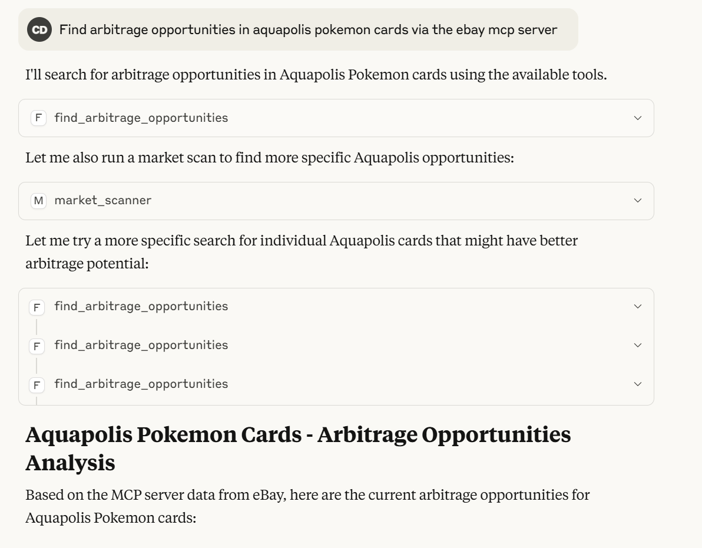

# Ebay MCP Server

Need to create an ebay developer account(1 day wait) then a sandbox API token.
Add this info the the .env file, setup the Claude MCP settings to run the python
script and restart Claude.

Sometimes I need to manually specify that claude should use the ebay mcp server otherwise itll default to web searches!

```bash
Describe the current market of Armored Mewtwo SM228 pokemon cards via ebay mcp server.
```


For the arbitrage part, this code needs to be workshopped to include specific strategies to be useful but at a high level the MCP server gets used correctly by Claude even in more generic prompts,

```bash
Find arbitrage opportunities in aquapolis pokemon cards via the ebay mcp server
```

